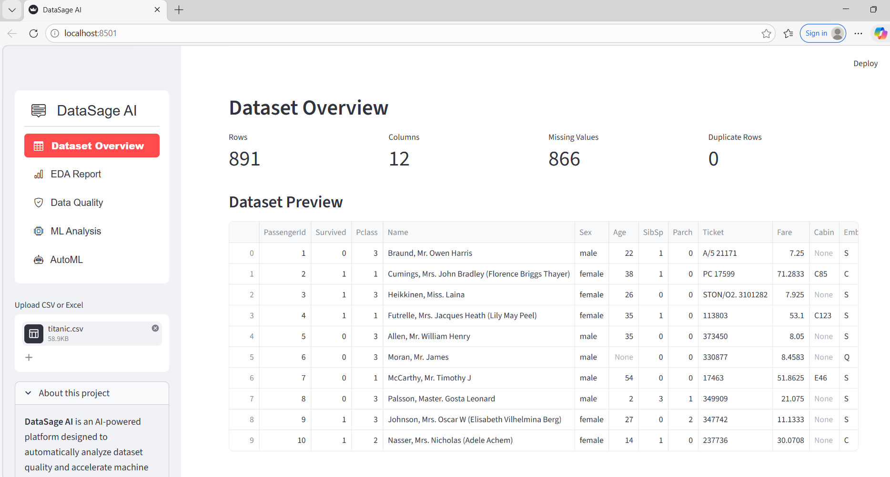
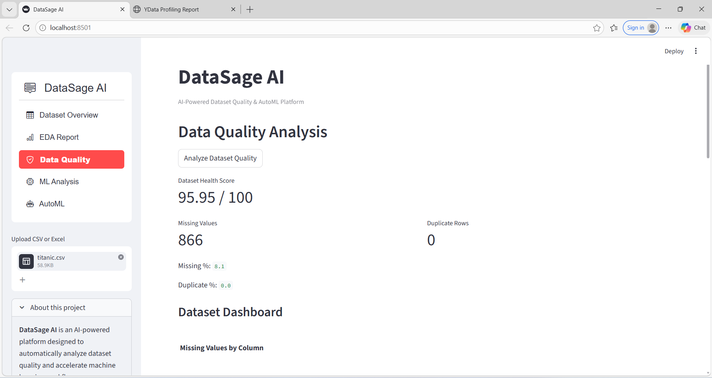
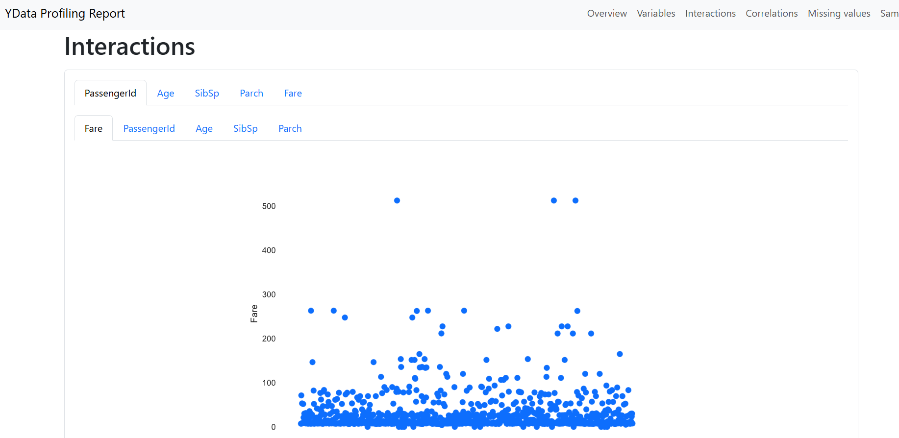
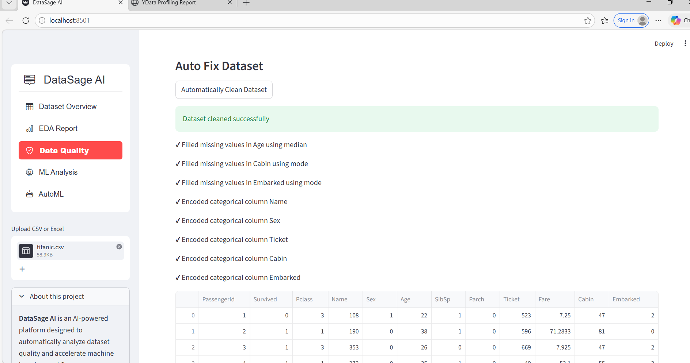
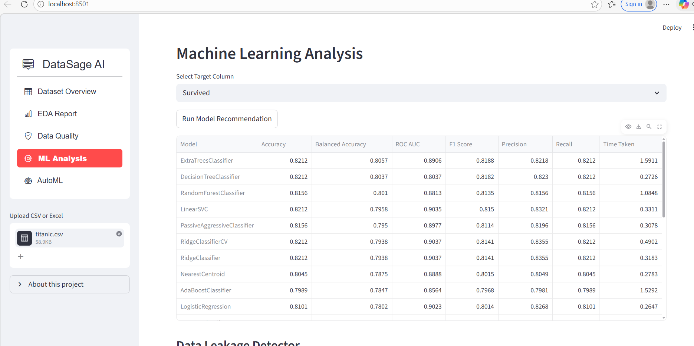
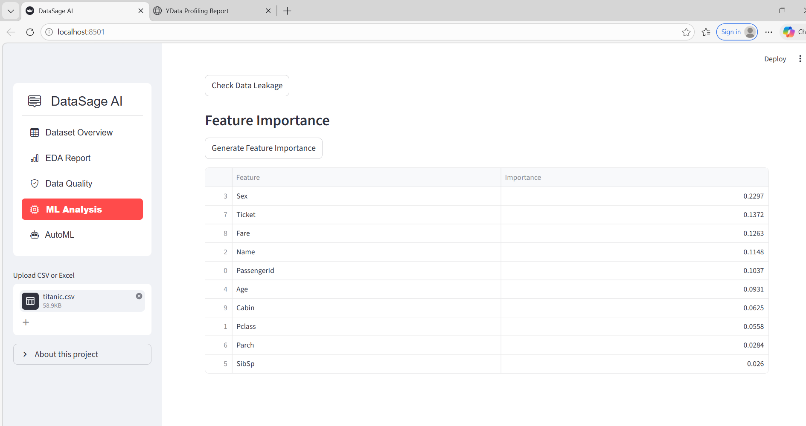
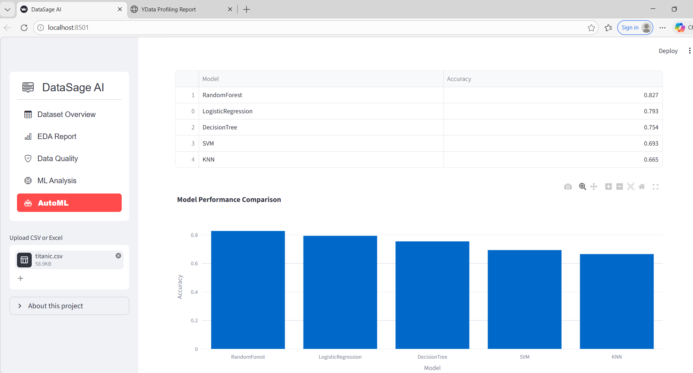

# DataSage AI
### AI-Powered Dataset Quality & AutoML Platform


---

## Overview

DataSage AI is an intelligent dataset analysis and AutoML platform built using **Streamlit, Scikit-learn, Pandas, and Plotly**.

The platform helps users:
- Analyze dataset quality
- Detect common data issues
- Generate automated EDA reports
- Clean datasets automatically
- Train multiple ML models
- Run AutoML pipelines
- Understand feature importance

It simplifies the complete machine learning preprocessing and model selection workflow through an interactive dashboard.

---

## Why DataSage AI?

Machine learning performance highly depends on dataset quality.
However, real-world datasets often contain:

| Issue | Description |
|-------|-------------|
| Missing values | Incomplete records across features |
| Duplicate records | Redundant rows affecting model training |
| Outliers | Extreme values skewing distributions |
| Data leakage | Features with undue correlation to the target |
| Skewed distributions | Imbalanced feature spread |
| Inconsistent formats | Mixed types or encoding issues |

DataSage AI automates detection and resolution of these issues to reduce manual effort and accelerate the ML workflow.

---

## Application Screenshots

| Feature | Preview |
|--------|---------|
| Dataset Overview |  |
| Data Quality Analysis |  |
| EDA Report |  |
| Auto Fix Dataset |  |
| ML Model Analysis |  |
| Feature Importance |  |
| AutoML Results |  |

---

## Core Features

### 📁 Dataset Upload & Overview
- Upload CSV and Excel datasets
- Interactive dataframe preview
- Dataset dimensions and column analysis
- Automatic datatype detection

---

### 📊 Automated EDA Report
Generates a detailed Exploratory Data Analysis report using **ydata-profiling**.

Includes:
- Variable distributions
- Missing value visualization
- Correlation analysis
- Statistical summaries
- Dataset samples
- Downloadable interactive HTML reports

---

### 🏥 Dataset Health Score
Calculates an overall dataset quality score (out of 100) based on:
- Missing values
- Duplicate rows
- Completeness
- Data consistency

---

### 🔍 Data Quality Detection
Automatically identifies:
- High missing value columns
- Duplicate rows
- Potential outliers
- Skewed distributions
- Data imbalance

---

### AI-Based Cleaning Suggestions
Provides intelligent recommendations for:
- Missing value treatment
- Duplicate removal
- Encoding categorical variables
- Feature preprocessing

---

### 🧹 Automatic Dataset Cleaning
One-click preprocessing pipeline:
- Fill missing values
- Remove duplicates
- Encode categorical features
- Prepare data for ML training

---

### 🧠 Machine Learning Model Recommendation
Trains and compares multiple models:

| Model | Type |
|-------|------|
| Logistic Regression | Linear |
| Random Forest | Ensemble |
| Decision Tree | Tree-based |
| Support Vector Machine (SVM) | Kernel-based |
| K-Nearest Neighbors (KNN) | Instance-based |

Displays performance comparison metrics across all models.

---

### ⚡ AutoML Pipeline
Automatically:
- Trains multiple models
- Selects the best-performing model
- Displays accuracy comparison
- Generates prediction-ready output

---

### 📌 Feature Importance & Explainability
Uses Random Forest explainability to:
- Identify the most important features
- Understand model behavior
- Improve interpretability

---

### 🚨 Data Leakage Detection
Detects features with unusually high correlation to the target variable to help prevent overfitting.

---

### 📝 AI Dataset Summary
Generates human-readable insights including:
- Dataset size
- Missing value count
- Duplicate count
- Feature observations
- Overall dataset condition

---

## System Architecture
User Upload
↓
Streamlit Interface
↓
Data Processing Layer (Pandas)
↓
Data Quality Engine
↓
AI Suggestion Engine
↓
ML & AutoML Pipeline
↓
Visualization Dashboard

---

## Tech Stack

| Category | Tools |
|----------|-------|
| Language | Python 3.10 |
| UI Framework | Streamlit |
| Data Processing | Pandas, NumPy |
| ML Models | Scikit-learn |
| Visualization | Plotly |
| EDA Reporting | ydata-profiling |

---

## Project Structure
datasage-ai/
│
├── app.py
├── requirements.txt
├── README.md
│
├── utils/
│   ├── auto_fix.py
│   ├── automl_pipeline.py
│   ├── cleaning_suggestions.py
│   ├── dashboard.py
│   ├── data_quality.py
│   ├── dataset_report.py
│   ├── error_detection.py
│   ├── explainability.py
│   ├── leakage_detector.py
│   └── model_recommender.py
│
└── screenshots/

---

## Installation & Setup

### 1. Clone the Repository
```bash
git clone https://github.com/khushi-1102/dataset-analyzer-ai.git
cd datasage-ai
```

### 2. Install Dependencies
```bash
pip install -r requirements.txt
```

### 3. Run the Application
```bash
streamlit run app.py
```

---

## Workflow

Upload dataset
View dataset overview
Analyze dataset quality
Detect issues and view AI suggestions
Generate EDA report
Run ML model recommendation
Execute AutoML pipeline
View feature importance analysis


---

## Example Datasets

### 🚢 Titanic Dataset
- **Source:** [Kaggle](https://www.kaggle.com/datasets/yasserh/titanic-dataset)
- **Target Column:** `Survived`

### 🎓 Student Performance Dataset
- **Source:** [GitHub Raw CSV](https://raw.githubusercontent.com/selva86/datasets/master/StudentsPerformance.csv)
- **Target Column:** `math score`

---

## Future Enhancements

- [ ] Real-time data drift detection
- [ ] Bias and fairness analysis
- [ ] Deep learning model integration
- [ ] AI chatbot support
- [ ] Cloud deployment (AWS / GCP)
- [ ] Automated feature engineering
- [ ] Model export functionality

---

## Author

**Khushi**
B.Tech CSE (AI/ML)
